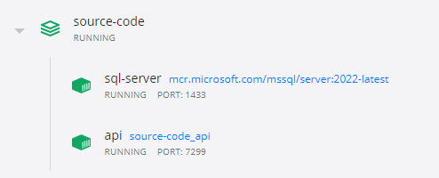

# Dukkantek - Inventory Case Study

## Features

The goal is to create an inventory capable of the following:
- Sell a product
- Change the status of a product
- Count the number of products sold, damaged and inStock

The API was designed from the client's point of view; there are two important considerations here: 
- Sell a Product puts a Product in the InStock status
- Buy a Product, on the other hand, would put a Product in the Sold status

## DDD

DDD is a software development approach to building complex application
I used DDD in the implementation of the code

I have created Entities, Value Objects, Use validations in a DDD way
I followed Vladimir Khorikov's validation method here: https://enterprisecraftsmanship.com/posts/validation-and-ddd/ 


## TDD

The project was written using TDD; that's why you should see tests for every feature developed so far.
TDD is a game changer; it alleviates the anxiety of coding while thinking first about the feature before coding it.

## Architecture

I followed the Onion Architecture approach.

Clean Architecture, Hexagonal architecture and Onion architecture are, in essence, the same thing; they help us to build maintainable, testable and decoupled applications. The only real difference is the name of the layers.


## Testing strategy

What is a unit test? The unit, in a unit test is a use case. It is Martin Fowler and Kent Beck's approach.
Valentina Cupac explains well this approach in the following videos:
- https://www.youtube.com/watch?v=3wxiQB2-m2k
- https://www.youtube.com/watch?v=IZWLnn2fNko

A unit test can be just testing a method in a particular class too. When we do this kind of test is because there is a combinatory explosion. The validators I've done fit well in this specific case, so I added tests for them separately.

What are integration tests? It tests the secondary adapters if we put it in terms of the hexagonal architecture.
We should test not only the real implementation of the adapter but the test doubles because those test doubles are used in the unit test part, and they should behave as if it was the real implementation.

I followed the narrow integration tests approach suggested by Martin Fowler here: https://martinfowler.com/bliki/IntegrationTest.html

What are acceptance tests? The system from the point of view of the user.
I didn't add the acceptance tests, but creating another project and calling the endpoints should be easy.


## Authorisation and Authentication

It is a client-facing API and should be protected by some authorisation mechanism.
I would use an Authentication Server like IdentityServer to issue tokens for my clients; then, the clients will use those tokens to request the API resources.

The token could contain scopes that could be a granular approach to the authorisation part.


## Error handling & Responses to the consumer

- I use the Result type to communicate Errors in the system.
- In case of error, the Result contains an `Error(errorType,errorCodes)`, the `errorType` should be mapped to a specific HTTP status code in the controller before returning to the consumer
- I added an exception middleware to catch any exception that can occur in the system

The errors are communicated to the consumer in the following format for any error.

```
{
    "errorType": "invalid_request",
    "errorCodes": [
        "product_status_invalid"
    ]
}
```


## Containerisation

I use Sql Server Docker image for the database
I containerised the Api using dotnet sdk:6 alpine image from Microsoft


 
## Databases

I used Sql Server 2022
mcr.microsoft.com/mssql/server:2022-latest


## EF Core

When you execute the `./run.sh`, it will create the database and the Products table using the `InitialCreate` migration class present in the `Migrations` folder  

The `./run.sh` will run EF Core commands through the Makefile to Initialise the database.

This is the command used to initialise the database
`dotnet ef database update --project src/dukkantek.Api`


## Monitoring & Observability

Monitoring helps you to understand what's failing.
Observability helps you to understand why it is failing.

For the sake of time, I didn't implement this, however, I could use the following technologies.

- Tracing: OpenTelemetry + Grafana
- Metrics: Prometheus + Grafana
- Logs: Serilog + Seq or DataDog

## MediatR

I am using mediatR in the project to decouple my application code from the top-level framework code.


## How to use the API

Execute the `./run.sh`, it will create two containers and then use postman or swagger to communicate with the api via http requests

### Create products

```
POST http://localhost:5164/products
{
    "Name": "Onion",
    "Barcode": "12345",
    "Description": "White Onion",
    "CategoryName": "Vegetable",
    "Weighted": true
}
```

### Change product's status

```
PUT http://localhost:5164/products/{jti}/status
{
    "Status": "Sold"
}
```

### Count Products

```
GET http://localhost:5164/products/count-products
```

### Get All Products

```
GET http://localhost:5164/products
```

## Swagger

```
https://localhost:7299/swagger/index.html
```
